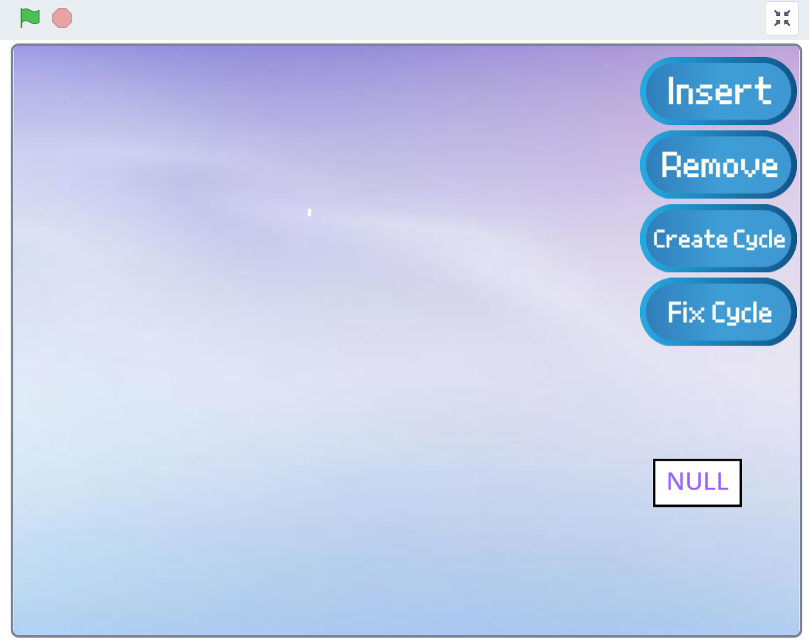

# DSA_software_project -- Singly Linked List Visualization
## Introduction
The Scratch project will support four operations of Singly Linked List, including `Insert`, `Remove`, `Create Cycle`, and `Detect & Fix Cycle`. Our goal is to visualize the singly linked list and demonstrate the basic operations of a linked list through interactive animations.

## Link 
https://scratch.mit.edu/projects/1173413901

## Features
### color explanation
we will use color to show status of each node:

- white: Normal node
- orange: Selected node
- lime: Insert--the node after Selected
- pink: Remove--the node will be remove
- yellow:  Cycle node-- the node before the entrance and the entrance node itself

:warning: After each operation, all nodes will become white. 
:warning: if any operation is invalid, the interface will show `Invalid inputs`
### Insert
This operation inserts a new node after a selected node.
1. Click the `Insert` button.
1. The interface shows `new node name?`
    - User enters the name of the new node
1. If the linked list is not empty (`head $ \neq $ NULL`), the interface shows `Insert after?`
    - the user selects a node by entering its number. (The selected node turns to orange)
1. The next node of the selected node turns to lime. (if it existed)
1. A new node will be inserted after the selected node.
1. All nodes turn to white

Constraint: There are at most 12 nodes. If you insert a new node, it will exceed the limit, the interface displays It's full, cannot Insert

### Remove (Remove after)
This operation remove the node after the selected node.
1. Click the `Remove` button.
1. If there isn't any node, the interface shows `No nodes in linked list!`, and then return.
1. The interface displays `Remove after?`
    - The user selects a node by entering its number.(The selected node turns to orange)
1.  If the node after the selected node exists (turns to pink.), and then the system will remove it.
    - Otherwise, the interface will show `Invalid input!` 
1. All nodes turn to white.
### Create Cycle
This operation creates a cycle by connecting the last node to a selected node.
1. Click the `Create Cylce` button.
1. The interface shows `Create cycle on?`
    - The user selects a node by entering its number.(turns to orange)
1. The last node in the list will be linked to the selected node, creating a cycle.
1. Insert and Remove operations will be disabled after this operation until cycle is detected and fixed.
### Detect & Fix Cycle
This operation detects whether the list contains a cycle and fix if found. The algorithm is use Floyd’s Cycle Detection.
1. Click the `Detect & Fix Cycle` button.
1. The system will detect whether a cycle exists by using Floyd’s Cycle Detection (Tortoise and Hare)
    - The tortoise moves one step at a time.
    - The hare moves two steps at at time.
    - If they meet, i.e. there exists a cycle, the interfaces shows `Cycle detected!`
    - Else, the interface shows `There's no cycle!`
1. If a cycle exists, the system will fix it
    - move hare to head, and move both ptr one step at a time.
    - The node where they meet again will be the entrance node of the cycle.
    (turns to yellow)
    - The system break the cycle.
1. All nodes turn to white.

## Usage
1. Click the green flag to start the project.

1. The list is initially empty — insert at least one node to begin.
1. Follow the instructions described in the Features section to execute.

## Contribution
DSA Group 30: 
- 楊硯堯: PM
- 張軒瑋: BE
- 張正謙: FE
- 李政諺: FE
- 郭俐欣(Alexa): QA

Thank you very much to all the above people for their efforts and contributions